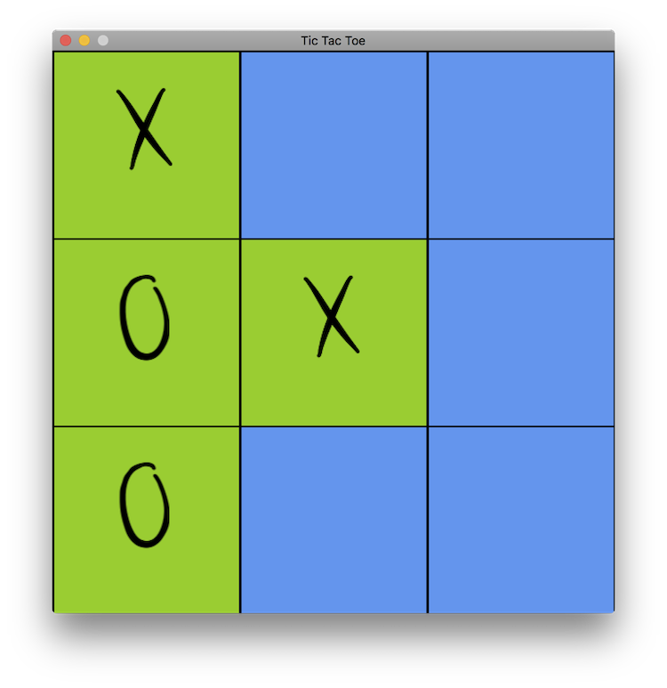

# TicTacToe

Another TicTacToe game I started writing because I wasn't getting sleep. This time using MonoGame. Was able to learn it quick because I've used XNA back in 2012.

## Building the project on a Mac

**Requirements:**

- VS for Mac | [Download Page](https://www.visualstudio.com/vs/visual-studio-mac/)
- Mono | [Download Page](http://www.mono-project.com/download) | `brew install mono`
- MonoGame | [Download Page](http://www.monogame.net/downloads/)

**Steps:**

1. Clone the repo. (For shallow clone: `git clone --depth 1 https://github.com/gldraphael/mg-ttt.git`)
1. Open the `src/TicTacToe/Content/Content.mcgb` file with MonoGame's Pipeline tool and build it
1. Open the solution file at `src/TicTacToe.sln` using VS for Mac
1. Run the App from within VS for Mac using <kbd>Cmd+Return</kbd>

---

**README TODO**

1. Add steps to build the solution without Visual Studio. Should be doable using `xbuild` or `msbuild`.
1. Add build steps for Linux and Windows.